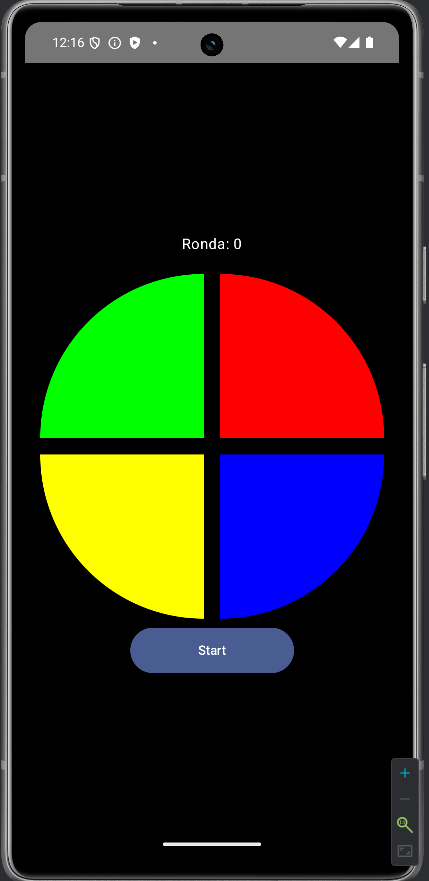

# SimonDice - Proyecto Android con Kotlin y Jetpack Compose

## Introducción

Este proyecto consiste en una implementación del clásico juego **"Simón Dice"** utilizando **Jetpack Compose** como framework para construir la interfaz de usuario. A lo largo de este desarrollo, se aplicaron patrones de diseño como **MVVM (Model-View-ViewModel)**, el uso de **estados**, el patrón **Observer** y se integraron **corrutinas de Kotlin** para manejar procesos asíncronos.

---

## Contenido

1. [Estructura del Proyecto](#estructura-del-proyecto)
2. [Explicación del Código](#explicación-del-código)
    - [Uso del Patrón MVVM](#uso-del-patrón-mvvm)
    - [Gestión de Estados](#gestión-de-estados)
    - [Patrón Observer](#patrón-observer)
    - [Corrutinas en Kotlin](#corrutinas-en-kotlin)
3. [Funcionalidad del programa](#funcionalidad-del-programa)
4. [Conclusión](#conclusión)
5. [Mejoras Futuras](#mejoras-futuras)

---

## Estructura del Proyecto

El proyecto está dividido en los siguientes archivos principales:

- **MainActivity.kt**: Punto de entrada de la aplicación donde se inicializa la UI.
- **ModelView.kt**: Clase que implementa la lógica del juego y actúa como el ViewModel del proyecto.
- **IU.kt**: Funciones Composable que definen la interfaz gráfica.
- **Datos.kt**: Objeto que almacena datos compartidos entre las capas.
- **Enums.kt**: Contiene las enumeraciones para los estados del juego y los colores de los botones.

---

## Explicación del Código

### Uso del Patrón MVVM

El patrón **MVVM** separa las responsabilidades en tres capas:

1. **Modelo (Model)**: Representado aquí por el objeto `Datos`, que contiene datos compartidos como la variable `ronda`.
2. **Vista (View)**: Las funciones Composable en `IU.kt` se encargan de renderizar la interfaz gráfica y reaccionar a cambios en los datos.
3. **ViewModel (ModelView)**: Contiene la lógica de negocio, como el manejo de secuencias de colores y estados del juego.

Esta arquitectura permite que la lógica y la vista sean independientes, facilitando pruebas y mantenimiento.

---

### Gestión de Estados

El juego utiliza estados para controlar su flujo. Estos estados están representados por la enumeración `Estados` y gestionados con `MutableLiveData` y `mutableStateOf`. Los estados son:

- **INICIO**: Cuando el juego está listo para comenzar.
- **GENERANDO**: El juego está mostrando la secuencia de colores.
- **ADIVINANDO**: El jugador debe replicar la secuencia.
- **PERDIDO**: El jugador falla la secuencia.

Ejemplo de cómo se utiliza el estado en el ViewModel:

```bash
estadoLiveData.value = Estados.GENERANDO
```

Los estados se usan en las funciones según sea necesario para controlar el flujo del juego y en la IU para mostrar la interfaz correcta:

```bash
when (estado) {
    Estados.INICIO -> {
        // Mostrar botón de inicio
    }
    Estados.GENERANDO -> {
        // Mostrar secuencia de colores
    }
    Estados.ADIVINANDO -> {
        // Permitir al jugador adivinar la secuencia
    }
    Estados.PERDIDO -> {
        // Mostrar mensaje de error
    }
}
```

### Patrón Observer

El patrón Observer se implementa con la clase `MutableLiveData` y las funciones `observeAsState`. Esto permite que los cambios en los datos reactivos actualicen automáticamente la interfaz de usuario.

Por ejemplo, el estado del juego (`estadoLiveData`) se observa en la función Composable principal:

```bash
val estado by viewModel.estadoLiveData.observeAsState(Estados.INICIO)
```

De esta forma, cualquier cambio en estadoLiveData actualiza dinámicamente la interfaz para reflejar el estado actual del juego.

### Funcionalidad del programa

Al ejecutar la aplicación, el usuario puede interactuar con el juego de **Simón Dice** siguiendo estos pasos:

1. **Inicio**: Al abrir la aplicación, el usuario ve un botón de "Start" para comenzar el juego.
2. **Generando Secuencia**: Al presionar "Start", la aplicación muestra una secuencia de colores que el usuario debe recordar.
3. **Adivinando Secuencia**: Después de mostrar la secuencia, el usuario debe replicarla presionando los botones de colores.
4. **Siguiente Ronda**: Si el usuario acierta, el juego avanza a la siguiente ronda con la secuencia anterior más un nuevo color.
5. **Fin del Juego**: Si el usuario falla, el juego termina y se muestra un mensaje de error.

Imagen de la aplicación iniciada:



### Corrutinas en Kotlin

Las corrutinas permiten gestionar procesos asíncronos de forma eficiente y sin bloquear el hilo principal. En este proyecto, se utilizan principalmente en la función `mostrarSecuencia` del ViewModel para manejar la animación de los colores:

```bash
viewModelScope.launch {
    for (color in secuenciaColores) {
        mensajeC.value = color.label
        delay(500)
        mensajeC.value = ""
        delay(500)
    }
    estadoLiveData.value = Estados.ADIVINANDO
}
```

Esto permite que la secuencia de colores se muestre de forma progresiva y asíncrona, sin bloquear la interfaz de usuario.

## Conclusión

Este proyecto demuestra cómo implementar un juego interactivo utilizando Jetpack Compose y prácticas modernas de desarrollo en Android. La combinación de MVVM, LiveData, corrutinas y una interfaz declarativa hace que el código sea modular, reactivo y fácil de mantener.

## Mejoras Futuras

Algunas mejoras que se podrían implementar en el futuro incluyen:

1. **Añadir dificultad**: Incrementar la velocidad de la secuencia según la ronda.
2. **Agregar sonidos**: Reproducir sonidos para cada color en la secuencia.
3. **Persistencia de datos**: Guardar la puntuación más alta en la base de datos local.
4. **Optimización de animaciones**: Mejorar la animación de los colores para una experiencia más fluida.
